# Auth & Profile Flow - Sprint 1

## Overview
Tài liệu mô tả các luồng xử lý cho tính năng authentication và profile management.

---

## 1. Flow Đăng ký (Register)

### Activity Diagram

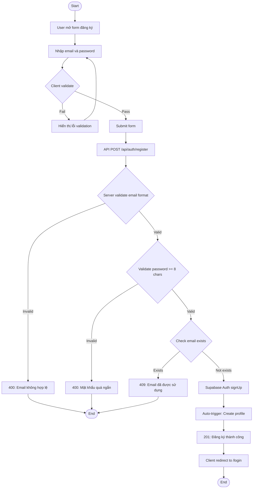

### Sequence Diagram

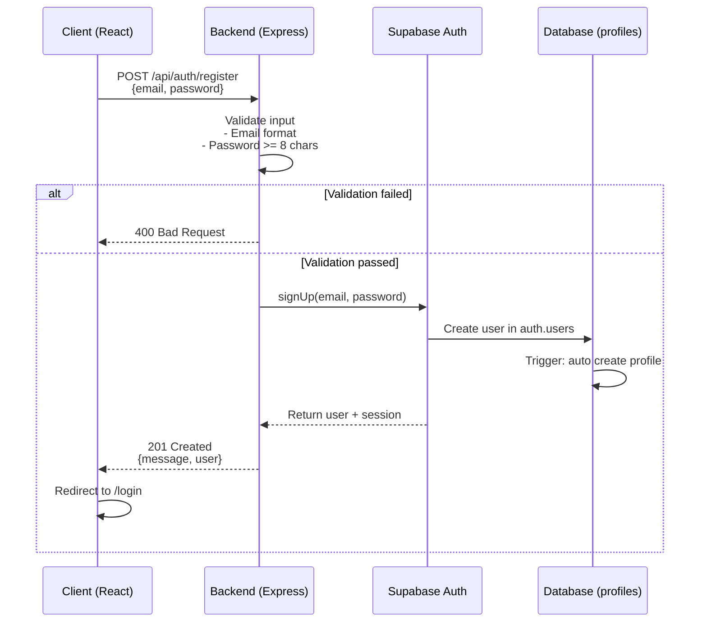

### API Endpoint

```
POST /api/auth/register
Content-Type: application/json

Request Body:
{
  "email": "user@example.com",
  "password": "SecurePass123!"
}

Success Response (201):
{
  "success": true,
  "message": "Đăng ký thành công",
  "data": {
    "user": {
      "id": "uuid",
      "email": "user@example.com"
    }
  }
}

Error Responses:
- 400: Validation error (email format, password too short)
- 409: Email already exists
- 500: Server error
```

### Validation Rules
- Email: format hợp lệ, lowercase, trim whitespace
- Password: tối thiểu 8 ký tự

### Error Handling
| Error | HTTP Code | Message |
|-------|-----------|---------|
| Email trống/sai format | 400 | "Email không hợp lệ" |
| Password < 8 ký tự | 400 | "Mật khẩu phải có ít nhất 8 ký tự" |
| Email đã tồn tại | 409 | "Email đã được sử dụng" |
| Lỗi server | 500 | "Đã có lỗi xảy ra, vui lòng thử lại" |

---

## 2. Flow Đăng nhập (Login + JWT)

### Activity Diagram

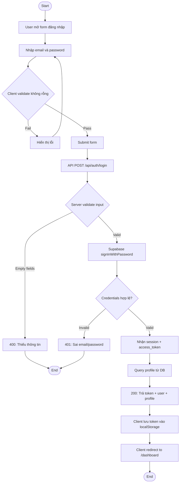

### Sequence Diagram

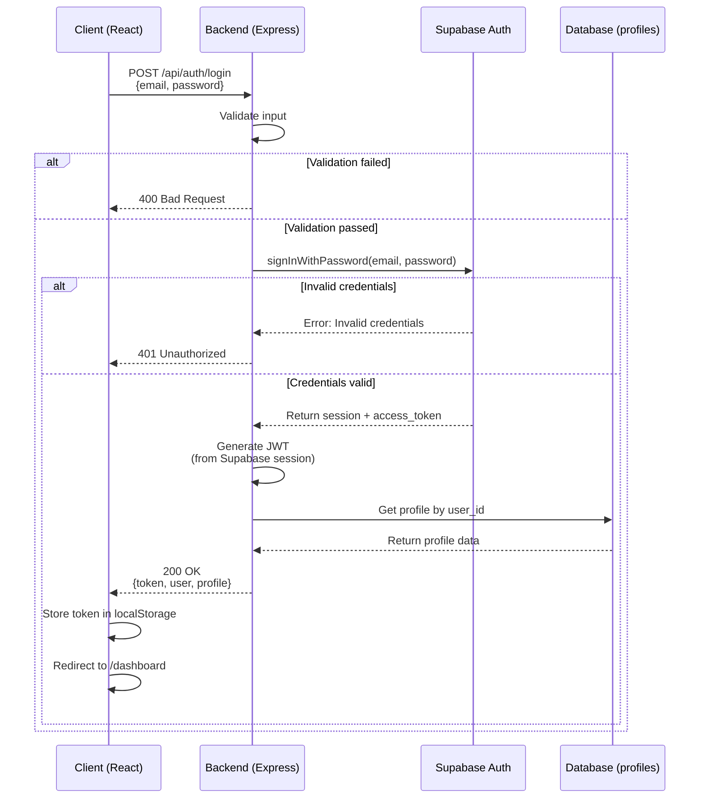

### API Endpoint

```
POST /api/auth/login
Content-Type: application/json

Request Body:
{
  "email": "user@example.com",
  "password": "SecurePass123!"
}

Success Response (200):
{
  "success": true,
  "message": "Đăng nhập thành công",
  "data": {
    "token": "eyJhbGciOiJIUzI1NiIsInR5cCI6IkpXVCJ9...",
    "user": {
      "id": "uuid",
      "email": "user@example.com"
    },
    "profile": {
      "display_name": "John Doe",
      "height_cm": 170,
      "weight_kg": 65,
      "body_photo_url": null
    }
  }
}

Error Responses:
- 400: Validation error
- 401: Invalid credentials
- 500: Server error
```

### JWT Token Structure
```json
{
  "sub": "user_uuid",
  "email": "user@example.com",
  "iat": 1234567890,
  "exp": 1234571490
}
```
- Token TTL: 1 hour (có thể cấu hình qua env)
- Refresh: Client tự động refresh khi token sắp hết hạn

### Client Storage
- Lưu token vào `localStorage.setItem('token', token)`
- Gắn token vào header cho các request: `Authorization: Bearer <token>`

### Error Handling
| Error | HTTP Code | Message |
|-------|-----------|---------|
| Email/password trống | 400 | "Vui lòng nhập đầy đủ thông tin" |
| Sai email/password | 401 | "Email hoặc mật khẩu không đúng" |
| Lỗi server | 500 | "Đã có lỗi xảy ra, vui lòng thử lại" |

---

## 3. Flow Lấy Profile (Get Profile)

### Activity Diagram

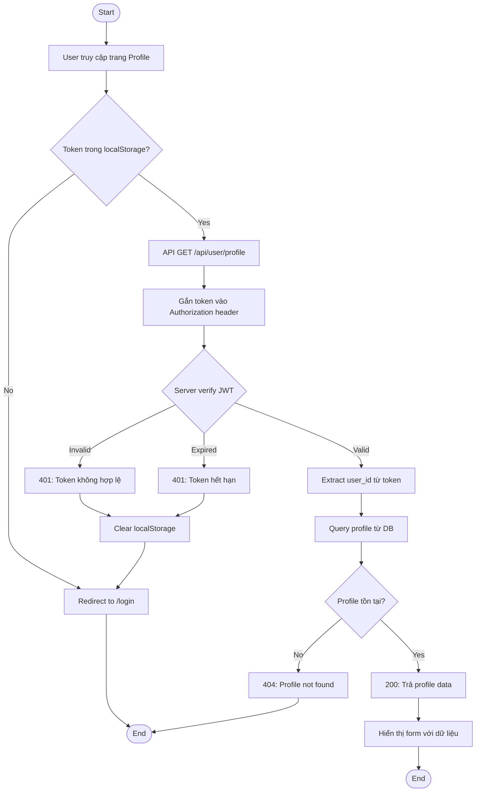

### Sequence Diagram

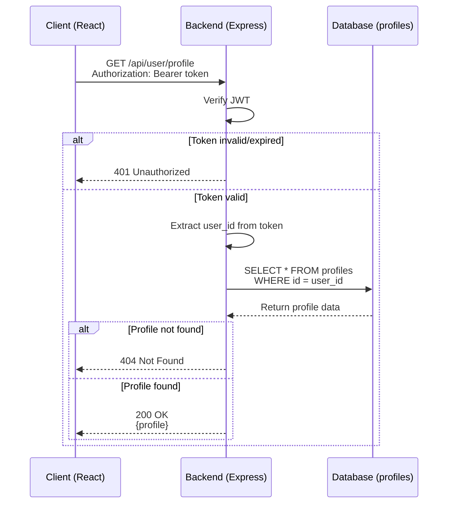

### API Endpoint

```
GET /api/user/profile
Authorization: Bearer <token>

Success Response (200):
{
  "success": true,
  "data": {
    "id": "uuid",
    "email": "user@example.com",
    "display_name": "John Doe",
    "height_cm": 170,
    "weight_kg": 65,
    "body_photo_url": "https://storage.supabase.co/...",
    "created_at": "2024-01-01T00:00:00Z",
    "updated_at": "2024-01-01T00:00:00Z"
  }
}

Error Responses:
- 401: Unauthorized (token missing/invalid/expired)
- 404: Profile not found
- 500: Server error
```

---

## 4. Flow Cập nhật Profile (Update Profile)

### Activity Diagram

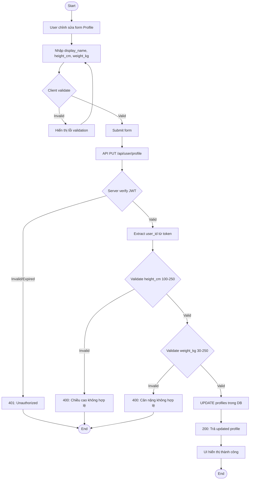

### Sequence Diagram

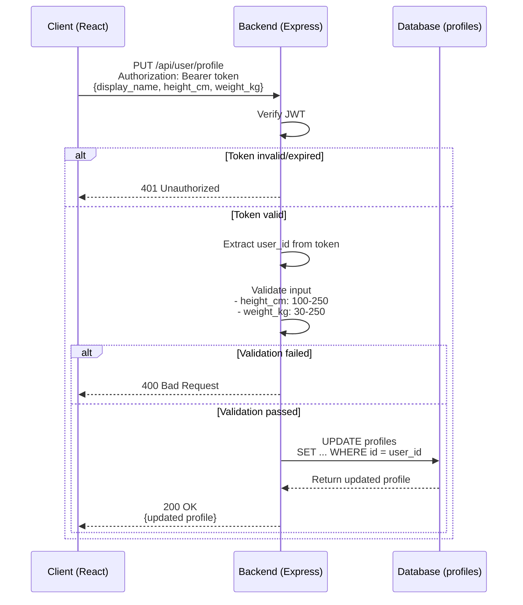

### API Endpoint

```
PUT /api/user/profile
Authorization: Bearer <token>
Content-Type: application/json

Request Body:
{
  "display_name": "John Doe",    // optional
  "height_cm": 170,              // optional, 100-250
  "weight_kg": 65                // optional, 30-250
}

Success Response (200):
{
  "success": true,
  "message": "Cập nhật hồ sơ thành công",
  "data": {
    "id": "uuid",
    "email": "user@example.com",
    "display_name": "John Doe",
    "height_cm": 170,
    "weight_kg": 65,
    "body_photo_url": "...",
    "updated_at": "2024-01-02T00:00:00Z"
  }
}

Error Responses:
- 400: Validation error
- 401: Unauthorized
- 500: Server error
```

### Validation Rules
- `display_name`: string, optional, max 100 ký tự
- `height_cm`: number, optional, 100-250
- `weight_kg`: number, optional, 30-250

### Error Handling
| Error | HTTP Code | Message |
|-------|-----------|---------|
| height_cm ngoài khoảng | 400 | "Chiều cao phải từ 100cm đến 250cm" |
| weight_kg ngoài khoảng | 400 | "Cân nặng phải từ 30kg đến 250kg" |
| Token missing/invalid | 401 | "Vui lòng đăng nhập" |
| Token expired | 401 | "Phiên đăng nhập hết hạn" |

---

## 5. Flow Upload Ảnh Toàn Thân (Upload Body Photo)

### Activity Diagram

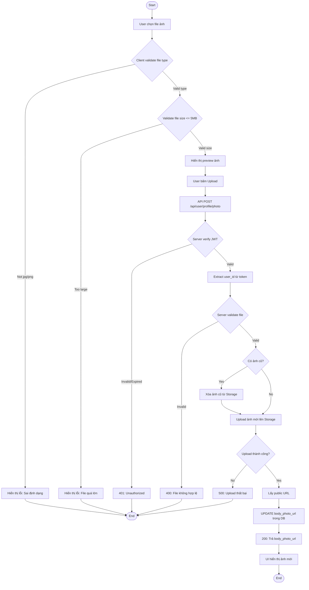

### Sequence Diagram

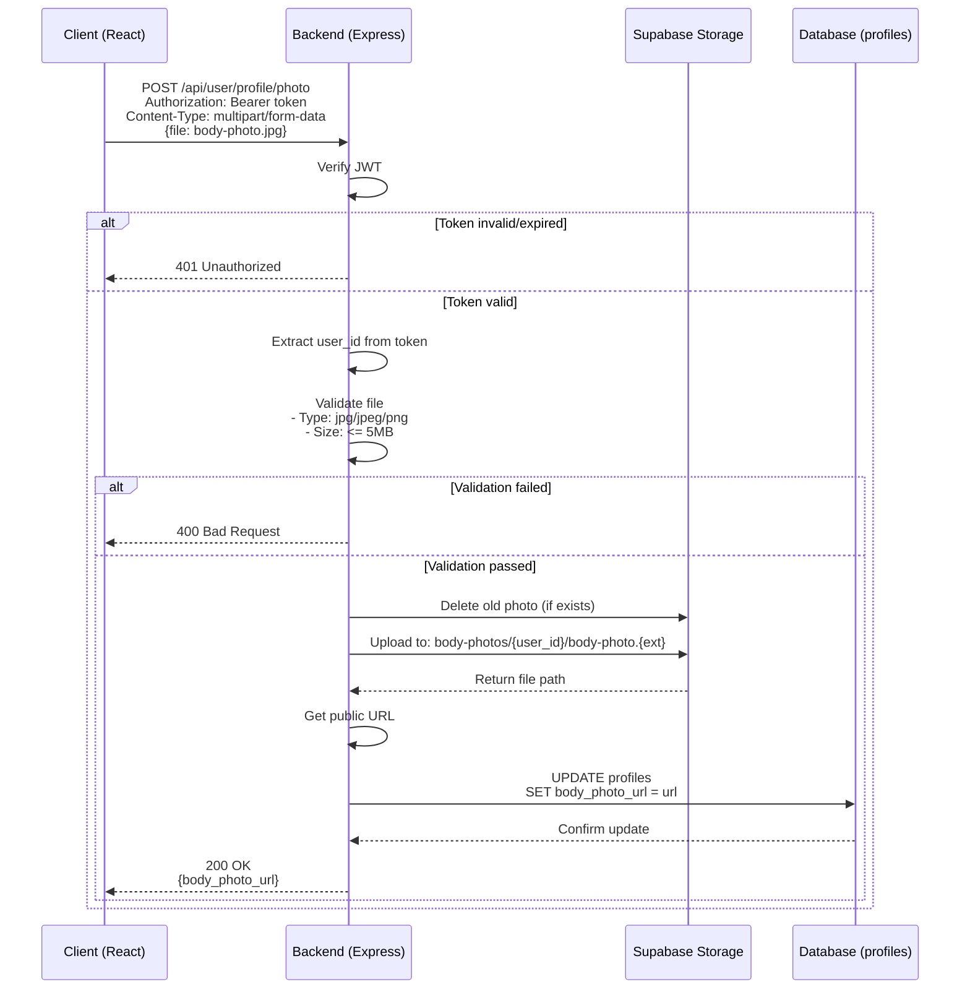

### API Endpoint

```
POST /api/user/profile/photo
Authorization: Bearer <token>
Content-Type: multipart/form-data

Form Data:
- file: <binary> (body photo)

Success Response (200):
{
  "success": true,
  "message": "Upload ảnh thành công",
  "data": {
    "body_photo_url": "https://xxx.supabase.co/storage/v1/object/public/body-photos/uuid/body-photo.jpg"
  }
}

Error Responses:
- 400: Invalid file type/size
- 401: Unauthorized
- 500: Upload failed
```

### Validation Rules
- File types: `image/jpeg`, `image/jpg`, `image/png`
- Max size: 5MB
- Chỉ 1 file/request

### Storage Path
- Bucket: `body-photos`
- Path: `{user_id}/body-photo.{ext}`
- Khi upload mới, xóa file cũ (nếu có) trước khi upload

### Error Handling
| Error | HTTP Code | Message |
|-------|-----------|---------|
| Không có file | 400 | "Vui lòng chọn ảnh" |
| Sai định dạng | 400 | "Chỉ chấp nhận file jpg, jpeg hoặc png" |
| File quá lớn | 400 | "Dung lượng file không được vượt quá 5MB" |
| Upload thất bại | 500 | "Upload ảnh thất bại, vui lòng thử lại" |

---

## 6. Flow Logout

### Activity Diagram

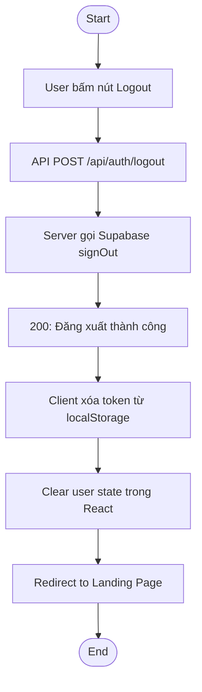

### Sequence Diagram

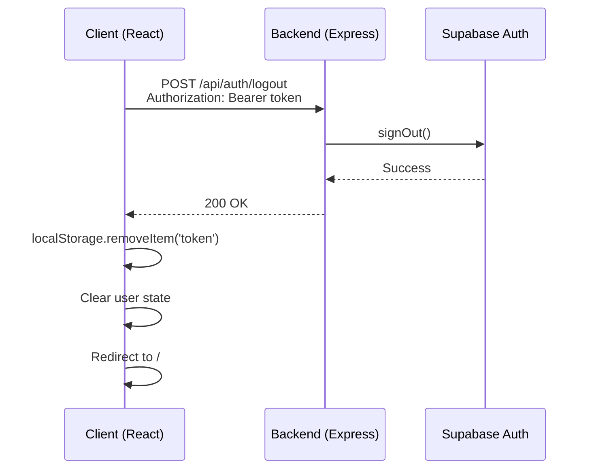

### API Endpoint

```
POST /api/auth/logout
Authorization: Bearer <token>

Success Response (200):
{
  "success": true,
  "message": "Đăng xuất thành công"
}
```

### Client Actions
1. Gọi API logout
2. Xóa token từ localStorage: `localStorage.removeItem('token')`
3. Clear user state trong React context/store
4. Redirect về trang Landing Page (`/`)

---

## 7. Flow Bảo vệ Routes (Protected Routes)

### Frontend Route Protection

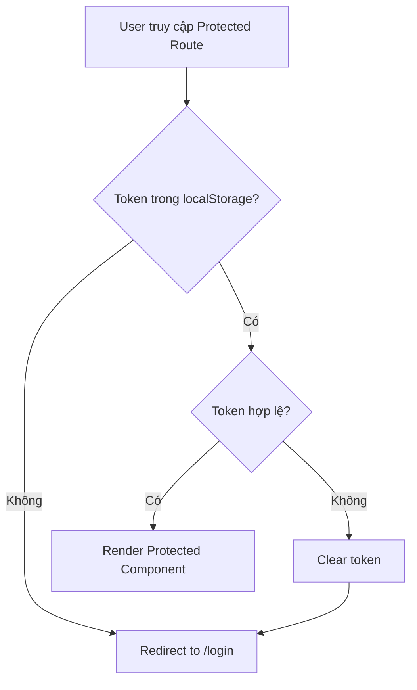

### ProtectedRoute Component Logic

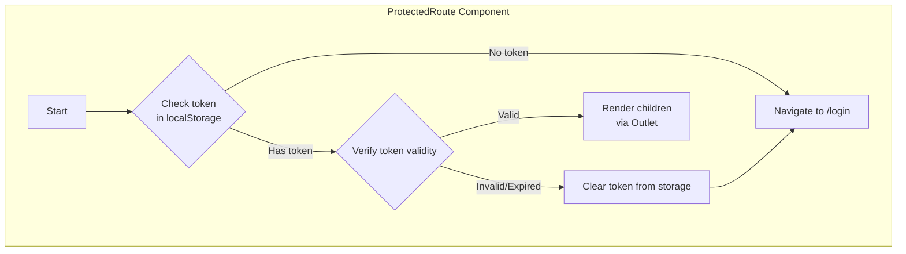

### Backend Middleware Protection

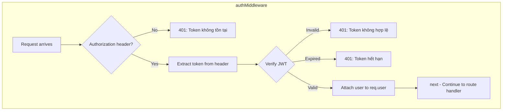

### Protected API Routes
| Method | Endpoint | Middleware |
|--------|----------|------------|
| GET | /api/user/profile | authMiddleware |
| PUT | /api/user/profile | authMiddleware |
| POST | /api/user/profile/photo | authMiddleware |
| POST | /api/auth/logout | authMiddleware |

### Public API Routes
| Method | Endpoint |
|--------|----------|
| POST | /api/auth/register |
| POST | /api/auth/login |

---

## Summary

### API Endpoints Overview

| Method | Endpoint | Auth | Description |
|--------|----------|------|-------------|
| POST | /api/auth/register | No | Đăng ký tài khoản |
| POST | /api/auth/login | No | Đăng nhập |
| POST | /api/auth/logout | Yes | Đăng xuất |
| GET | /api/user/profile | Yes | Lấy thông tin profile |
| PUT | /api/user/profile | Yes | Cập nhật profile |
| POST | /api/user/profile/photo | Yes | Upload ảnh toàn thân |

### Frontend Routes Overview

| Path | Component | Protected | Description |
|------|-----------|-----------|-------------|
| / | LandingPage | No | Trang chủ |
| /login | LoginPage | No | Trang đăng nhập |
| /register | RegisterPage | No | Trang đăng ký |
| /dashboard | Dashboard | Yes | Dashboard sau login |
| /profile | ProfilePage | Yes | Trang hồ sơ |

### Security Checklist
- [x] Password hash bằng bcrypt (Supabase Auth)
- [x] JWT với TTL hợp lý (1 hour)
- [x] CORS cấu hình đúng origin
- [x] RLS policies cho database
- [x] Storage policies cho file upload
- [x] Không log plaintext password
- [x] Error messages không lộ thông tin hệ thống
