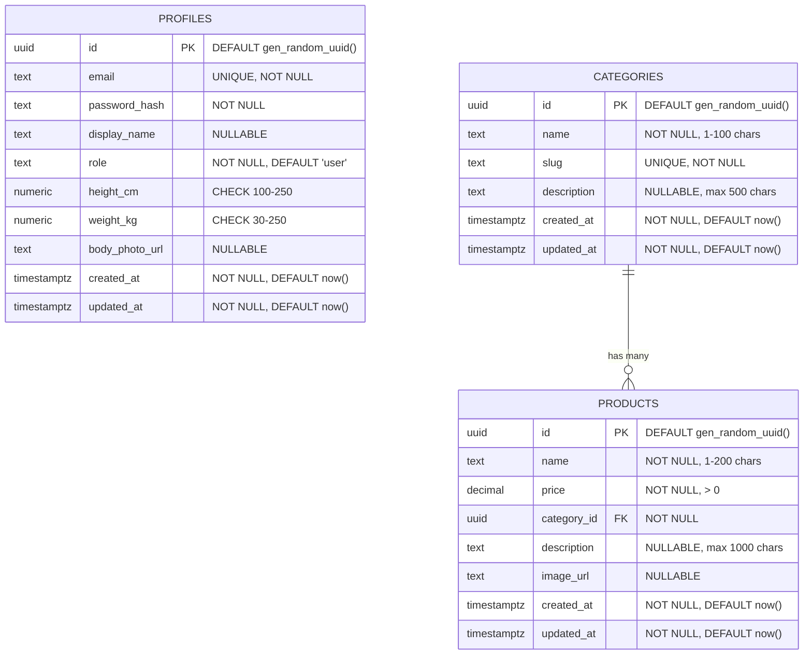

# Database Schema

## Overview
Schema cho ứng dụng Virtual Try-On, bao gồm authentication, profile management, và quản lý kho hàng.

## Tables

### profiles
Bảng lưu thông tin người dùng và dữ liệu hình thể.

| Column         | Type        | Constraints                                   | Description                                   |
|----------------|-------------|-----------------------------------------------|-----------------------------------------------|
| id             | uuid        | PK, DEFAULT gen_random_uuid()                 | Định danh người dùng                          |
| email          | text        | NOT NULL, UNIQUE                              | Email đăng nhập                               |
| password_hash  | text        | NOT NULL                                      | Mật khẩu đã băm                               |
| display_name   | text        | NULL                                          | Tên hiển thị                                  |
| role           | text        | NOT NULL, DEFAULT 'user', CHECK (role IN ('user', 'admin')) | Vai trò người dùng              |
| height_cm      | numeric     | NULL, CHECK (100-250)                         | Chiều cao (cm)                                |
| weight_kg      | numeric     | NULL, CHECK (30-250)                          | Cân nặng (kg)                                 |
| body_photo_url | text        | NULL                                          | URL ảnh toàn thân (Supabase Storage)          |
| created_at     | timestamptz | NOT NULL, DEFAULT now()                       | Thời gian tạo                                 |
| updated_at     | timestamptz | NOT NULL, DEFAULT now()                       | Thời gian cập nhật                            |

**Indexes:**
- `profiles_pkey`: PRIMARY KEY on `id`
- `profiles_email_key`: UNIQUE on `email`
- `profiles_email_idx`: INDEX on `email`

**Constraints:**
- `profiles_height_cm_check`: height_cm BETWEEN 100 AND 250
- `profiles_weight_kg_check`: weight_kg BETWEEN 30 AND 250
- `profiles_role_check`: role IN ('user', 'admin')

---

### categories
Bảng lưu danh mục sản phẩm.

| Column      | Type        | Constraints                     | Description              |
|-------------|-------------|---------------------------------|--------------------------|
| id          | uuid        | PK, DEFAULT gen_random_uuid()   | Định danh danh mục       |
| name        | text        | NOT NULL                        | Tên danh mục (1-100 ký tự) |
| slug        | text        | NOT NULL, UNIQUE                | Slug cho URL thân thiện  |
| description | text        | NULL                            | Mô tả danh mục (max 500) |
| created_at  | timestamptz | NOT NULL, DEFAULT now()         | Thời gian tạo            |
| updated_at  | timestamptz | NOT NULL, DEFAULT now()         | Thời gian cập nhật       |

**Indexes:**
- `categories_pkey`: PRIMARY KEY on `id`
- `categories_slug_key`: UNIQUE on `slug`
- `idx_categories_slug`: INDEX on `slug`

**Constraints:**
- `categories_name_length`: LENGTH(name) BETWEEN 1 AND 100
- `categories_description_length`: description IS NULL OR LENGTH(description) <= 500

---

### products
Bảng lưu thông tin sản phẩm.

| Column      | Type           | Constraints                           | Description                       |
|-------------|----------------|---------------------------------------|-----------------------------------|
| id          | uuid           | PK, DEFAULT gen_random_uuid()         | Định danh sản phẩm                |
| name        | text           | NOT NULL                              | Tên sản phẩm (1-200 ký tự)        |
| price       | decimal(10,2)  | NOT NULL, CHECK (price > 0)           | Giá sản phẩm                      |
| category_id | uuid           | NOT NULL, FK -> categories.id         | Danh mục sản phẩm                 |
| description | text           | NULL                                  | Mô tả sản phẩm (max 1000)         |
| image_url   | text           | NULL                                  | URL ảnh sản phẩm (Supabase Storage) |
| created_at  | timestamptz    | NOT NULL, DEFAULT now()               | Thời gian tạo                     |
| updated_at  | timestamptz    | NOT NULL, DEFAULT now()               | Thời gian cập nhật                |

**Indexes:**
- `products_pkey`: PRIMARY KEY on `id`
- `idx_products_category_id`: INDEX on `category_id`
- `idx_products_created_at`: INDEX on `created_at` (for pagination)

**Foreign Keys:**
- `products_category_id_fkey`: category_id REFERENCES categories(id) ON DELETE RESTRICT

**Constraints:**
- `products_name_length`: LENGTH(name) BETWEEN 1 AND 200
- `products_price_positive`: price > 0
- `products_description_length`: description IS NULL OR LENGTH(description) <= 1000

---

## Row Level Security (RLS)

### profiles
- Bật RLS, policies cho phép anon & authenticated với điều kiện `true`.
- Kiểm soát quyền thực hiện ở backend (JWT middleware).

### categories
- Bật RLS.
- `categories_select_all`: Cho phép tất cả (anon, authenticated) đọc danh mục.
- `categories_insert_admin`: Chỉ admin được tạo (kiểm tra ở backend).
- `categories_update_admin`: Chỉ admin được sửa (kiểm tra ở backend).
- `categories_delete_admin`: Chỉ admin được xóa (kiểm tra ở backend).

### products
- Bật RLS.
- `products_select_all`: Cho phép tất cả đọc sản phẩm.
- `products_insert_admin`: Chỉ admin được tạo (kiểm tra ở backend).
- `products_update_admin`: Chỉ admin được sửa (kiểm tra ở backend).
- `products_delete_admin`: Chỉ admin được xóa (kiểm tra ở backend).

---

## Triggers

### handle_updated_at
- Function cập nhật `updated_at` trước khi UPDATE.
- Áp dụng cho: `profiles`, `categories`, `products`.

---

## Storage

### Bucket: body-photos
- Mục đích: Lưu ảnh toàn thân của user.
- Access: Private (không public).
- File types: jpg, jpeg, png.
- Max size: 5MB.
- Structure: `{user_id}/body-photo.{ext}`.

**Policies:**
- `body_photos_select_own`: User chỉ xem ảnh của chính mình.
- `body_photos_insert_own`: User chỉ upload vào folder của mình.
- `body_photos_update_own`: User chỉ cập nhật ảnh của mình.
- `body_photos_delete_own`: User chỉ xóa ảnh của mình.

### Bucket: product-images
- Mục đích: Lưu ảnh sản phẩm (flat lay).
- Access: Public read, admin write.
- File types: jpg, jpeg, png.
- Max size: 5MB.
- Structure: `{product_id}/image.{ext}`.

**Policies:**
- `product_images_select_all`: Tất cả có thể xem ảnh sản phẩm.
- `product_images_insert_admin`: Chỉ admin upload (kiểm tra ở backend với service role).
- `product_images_update_admin`: Chỉ admin cập nhật (kiểm tra ở backend).
- `product_images_delete_admin`: Chỉ admin xóa (kiểm tra ở backend).

---

## ERD Diagram (Mermaid)

