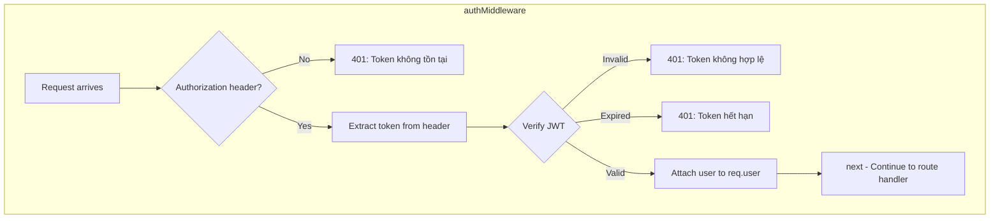

# US-01 - Auth Middleware Activity Diagram

```mermaid
flowchart TD
    subgraph authMiddleware
        A[Request arrives] --> B{Authorization header?}
        B -->|No| C[401: Token không tồn tại]
        B -->|Yes| D[Extract token from header]
        D --> E{Verify JWT}
        E -->|Invalid| F[401: Token không hợp lệ]
        E -->|Expired| G[401: Token hết hạn]
        E -->|Valid| H[Attach user to req.user]
        H --> I[next - Continue to route handler]
    end
```