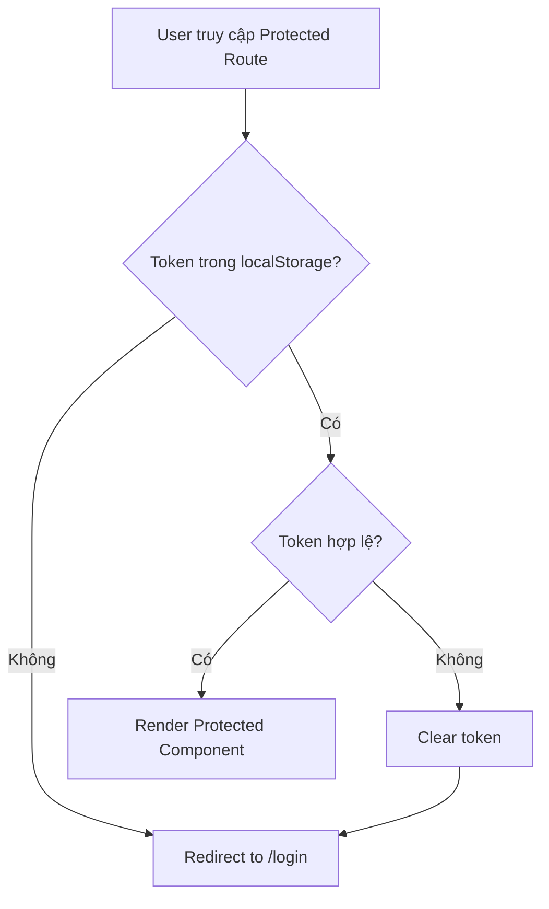

# US-01 - Frontend Route Protection Activity Diagram

```mermaid
flowchart TD
    A[User truy cập Protected Route] --> B{Token trong localStorage?}
    B -->|Không| C[Redirect to /login]
    B -->|Có| D{Token hợp lệ?}
    D -->|Không| E[Clear token]
    E --> C
    D -->|Có| F[Render Protected Component]
```