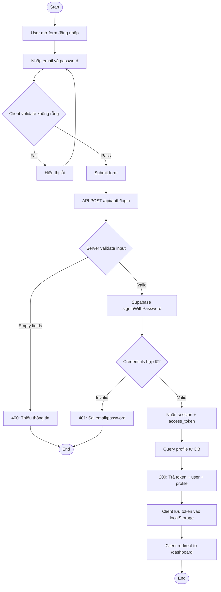

# US-01 - Login Activity Diagram

```mermaid
flowchart TD
    Start([Start]) --> A[User mở form đăng nhập]
    A --> B[Nhập email và password]
    B --> C{Client validate không rỗng}
    C -->|Fail| D[Hiển thị lỗi]
    D --> B
    C -->|Pass| E[Submit form]
    E --> F[API POST /api/auth/login]
    F --> G{Server validate input}
    G -->|Empty fields| H[400: Thiếu thông tin]
    H --> End1([End])
    G -->|Valid| I[Supabase signInWithPassword]
    I --> J{Credentials hợp lệ?}
    J -->|Invalid| K[401: Sai email/password]
    K --> End1
    J -->|Valid| L[Nhận session + access_token]
    L --> M[Query profile từ DB]
    M --> N[200: Trả token + user + profile]
    N --> O[Client lưu token vào localStorage]
    O --> P[Client redirect to /dashboard]
    P --> End2([End])
```