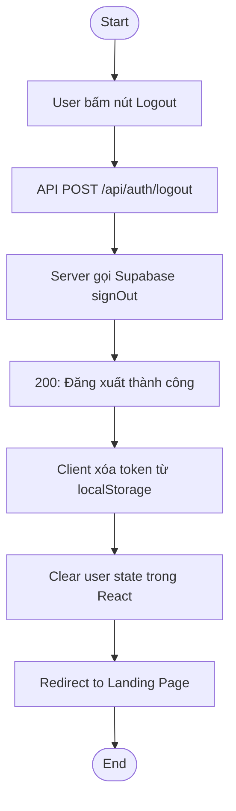

# US-01 - Logout Activity Diagram

```mermaid
flowchart TD
    Start([Start]) --> A[User bấm nút Logout]
    A --> B[API POST /api/auth/logout]
    B --> C[Server gọi Supabase signOut]
    C --> D[200: Đăng xuất thành công]
    D --> E[Client xóa token từ localStorage]
    E --> F[Clear user state trong React]
    F --> G[Redirect to Landing Page]
    G --> End([End])
```