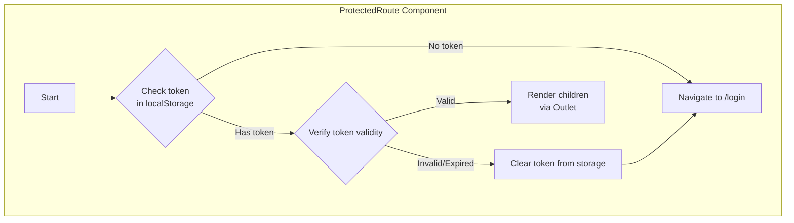

# US-01 - ProtectedRoute Component Activity Diagram

```mermaid
flowchart TD
    subgraph ProtectedRoute Component
        A[Start] --> B{Check token<br/>in localStorage}
        B -->|No token| C[Navigate to /login]
        B -->|Has token| D{Verify token validity}
        D -->|Invalid/Expired| E[Clear token from storage]
        E --> C
        D -->|Valid| F[Render children<br/>via Outlet]
    end
```