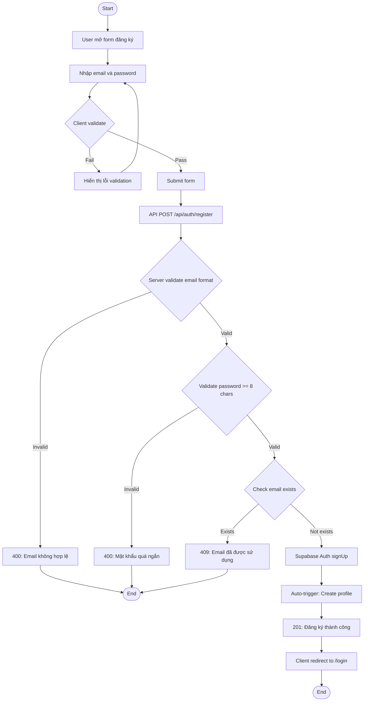

# US-01 - Register Activity Diagram

```mermaid
flowchart TD
    Start([Start]) --> A[User mở form đăng ký]
    A --> B[Nhập email và password]
    B --> C{Client validate}
    C -->|Fail| D[Hiển thị lỗi validation]
    D --> B
    C -->|Pass| E[Submit form]
    E --> F[API POST /api/auth/register]
    F --> G{Server validate email format}
    G -->|Invalid| H[400: Email không hợp lệ]
    H --> End1([End])
    G -->|Valid| I{Validate password >= 8 chars}
    I -->|Invalid| J[400: Mật khẩu quá ngắn]
    J --> End1
    I -->|Valid| K{Check email exists}
    K -->|Exists| L[409: Email đã được sử dụng]
    L --> End1
    K -->|Not exists| M[Supabase Auth signUp]
    M --> N[Auto-trigger: Create profile]
    N --> O[201: Đăng ký thành công]
    O --> P[Client redirect to /login]
    P --> End2([End])
```