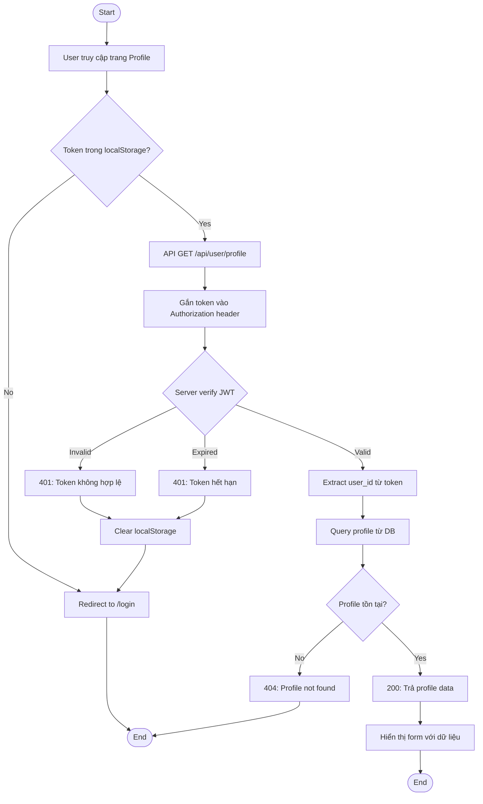

# US-02 - Get Profile Activity Diagram

```mermaid
flowchart TD
    Start([Start]) --> A[User truy cập trang Profile]
    A --> B{Token trong localStorage?}
    B -->|No| C[Redirect to /login]
    C --> End1([End])
    B -->|Yes| D[API GET /api/user/profile]
    D --> E[Gắn token vào Authorization header]
    E --> F{Server verify JWT}
    F -->|Invalid| G[401: Token không hợp lệ]
    G --> H[Clear localStorage]
    H --> C
    F -->|Expired| I[401: Token hết hạn]
    I --> H
    F -->|Valid| J[Extract user_id từ token]
    J --> K[Query profile từ DB]
    K --> L{Profile tồn tại?}
    L -->|No| M[404: Profile not found]
    M --> End1
    L -->|Yes| N[200: Trả profile data]
    N --> O[Hiển thị form với dữ liệu]
    O --> End2([End])
```