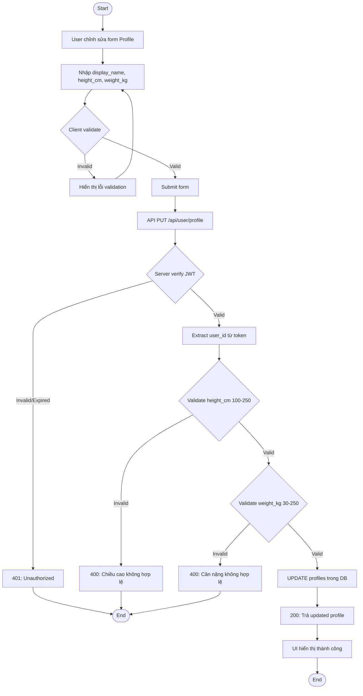

# US-02 - Update Profile Activity Diagram

```mermaid
flowchart TD
    Start([Start]) --> A[User chỉnh sửa form Profile]
    A --> B[Nhập display_name, height_cm, weight_kg]
    B --> C{Client validate}
    C -->|Invalid| D[Hiển thị lỗi validation]
    D --> B
    C -->|Valid| E[Submit form]
    E --> F[API PUT /api/user/profile]
    F --> G{Server verify JWT}
    G -->|Invalid/Expired| H[401: Unauthorized]
    H --> End1([End])
    G -->|Valid| I[Extract user_id từ token]
    I --> J{Validate height_cm 100-250}
    J -->|Invalid| K[400: Chiều cao không hợp lệ]
    K --> End1
    J -->|Valid| L{Validate weight_kg 30-250}
    L -->|Invalid| M[400: Cân nặng không hợp lệ]
    M --> End1
    L -->|Valid| N[UPDATE profiles trong DB]
    N --> O[200: Trả updated profile]
    O --> P[UI hiển thị thành công]
    P --> End2([End])
```