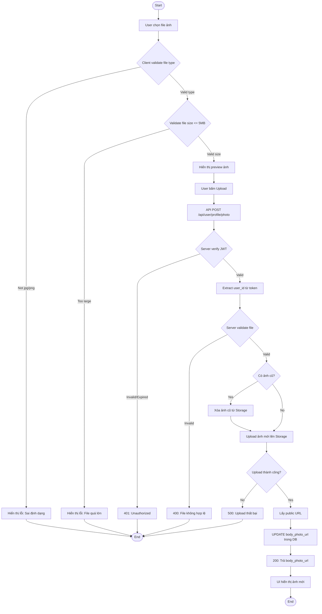

# US-02 - Upload Body Photo Activity Diagram

```mermaid
flowchart TD
    Start([Start]) --> A[User chọn file ảnh]
    A --> B{Client validate file type}
    B -->|Not jpg/png| C[Hiển thị lỗi: Sai định dạng]
    C --> End1([End])
    B -->|Valid type| D{Validate file size <= 5MB}
    D -->|Too large| E[Hiển thị lỗi: File quá lớn]
    E --> End1
    D -->|Valid size| F[Hiển thị preview ảnh]
    F --> G[User bấm Upload]
    G --> H[API POST /api/user/profile/photo]
    H --> I{Server verify JWT}
    I -->|Invalid/Expired| J[401: Unauthorized]
    J --> End1
    I -->|Valid| K[Extract user_id từ token]
    K --> L{Server validate file}
    L -->|Invalid| M[400: File không hợp lệ]
    M --> End1
    L -->|Valid| N{Có ảnh cũ?}
    N -->|Yes| O[Xóa ảnh cũ từ Storage]
    O --> P[Upload ảnh mới lên Storage]
    N -->|No| P
    P --> Q{Upload thành công?}
    Q -->|No| R[500: Upload thất bại]
    R --> End1
    Q -->|Yes| S[Lấy public URL]
    S --> T[UPDATE body_photo_url trong DB]
    T --> U[200: Trả body_photo_url]
    U --> V[UI hiển thị ảnh mới]
    V --> End2([End])
```