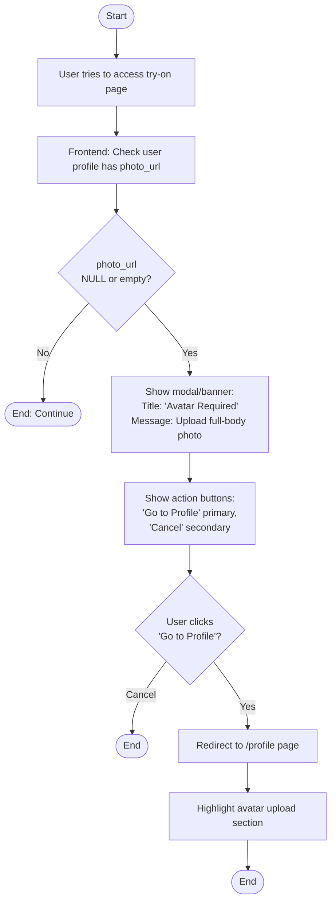
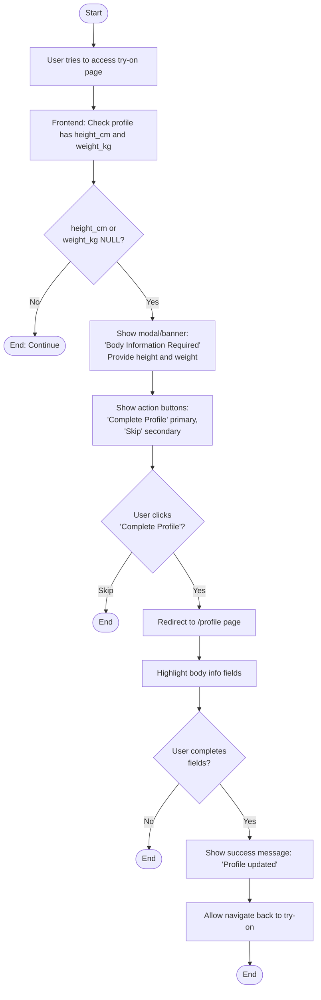
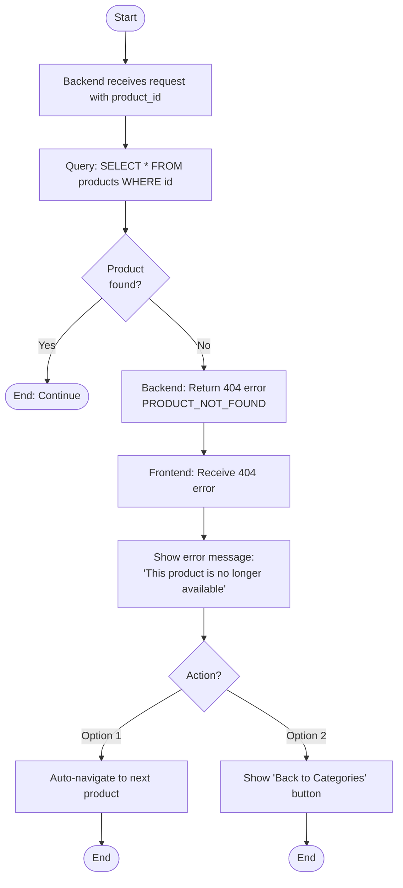
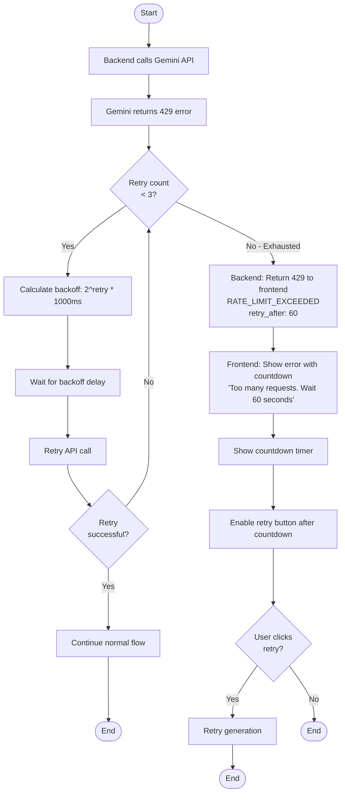
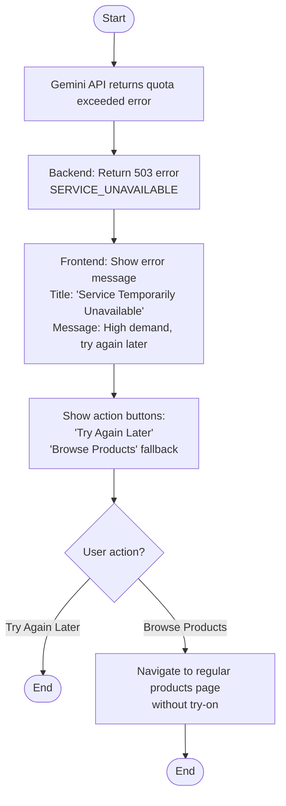
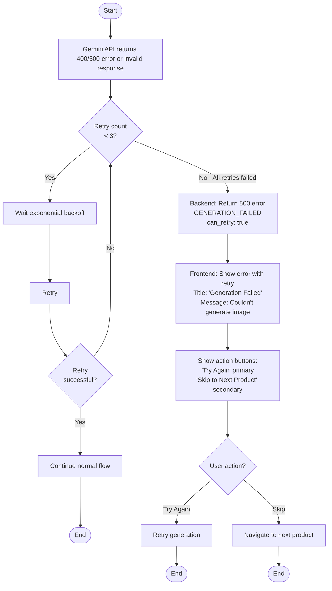
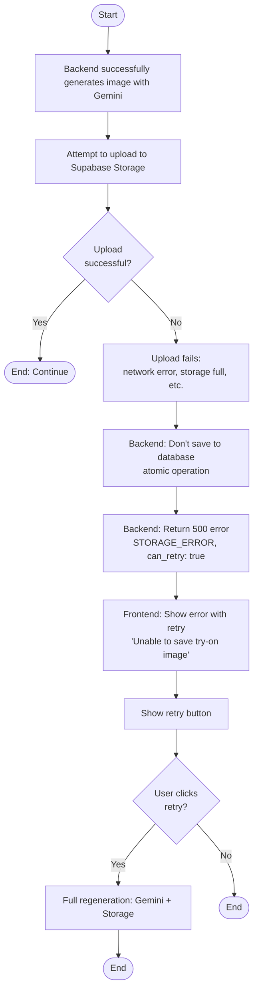
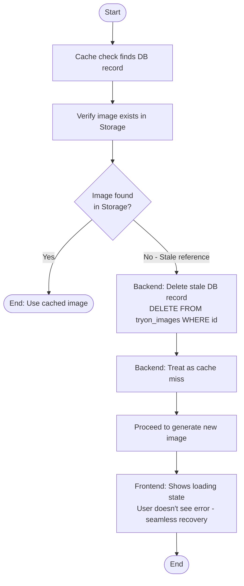
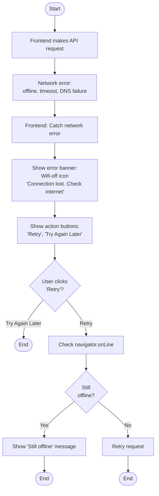

# US-05 & US-06: Error Handling Flows

## Mô tả
Tài liệu này mô tả chi tiết các luồng xử lý lỗi cho tính năng phòng thử đồ, bao gồm các lỗi từ validation, API, network, rate limiting, và storage.

## Error Categories

### 1. User Profile Errors
### 2. Product Data Errors
### 3. Gemini AI API Errors
### 4. Storage Errors
### 5. Network Errors
### 6. Database Errors
### 7. Rate Limiting Errors

---

## 1. User Profile Errors

### Error: No Avatar Uploaded



**HTTP Status:** None (frontend validation)
**User Message:** "Please upload a full-body photo to use virtual try-on feature."
**Recovery Action:** Navigate to profile page to upload avatar

---

### Error: Missing Body Information



**HTTP Status:** None (frontend validation)
**User Message:** "Please provide your height and weight for accurate try-on results."
**Recovery Action:** Navigate to profile page to fill in body info

---

## 2. Product Data Errors

### Error: Product Not Found



**HTTP Status:** 404
**Error Code:** PRODUCT_NOT_FOUND
**User Message:** "This product is no longer available."
**Recovery Action:** Auto-skip to next product or return to category selection

---

### Error: Product Has No Image

```
START
  |
  v
[Backend validates product has image_url]
  |
  v
[If image_url is NULL or empty]
  |
  v
[Backend: Return 400 error]
  Response: {
    error: "PRODUCT_IMAGE_MISSING",
    message: "Product image is not available"
  }
  |
  v
[Frontend: Receive 400 error]
  |
  v
[Log error]
  |
  v
[Auto-skip to next product]
  |
  v
[Show toast notification:]
  "Skipping product without image"
  |
  v
END
```

**HTTP Status:** 400
**Error Code:** PRODUCT_IMAGE_MISSING
**User Message:** "Skipping product without image" (toast, brief)
**Recovery Action:** Auto-skip to next available product

---

### Error: Empty Category

```mermaid
flowchart TD
    Start([Start]) --> A[User selects category]
    A --> B[Frontend: Call GET /api/tryon/products]
    B --> C[Backend: Return empty array<br/>products: [], total: 0]
    C --> D[Frontend: Check products.length === 0]
    D --> E{Products<br/>exist?}
    
    E -->|Yes| End1([End: Continue])
    
    E -->|No| F[Show empty state:<br/>Empty box icon<br/>'No Products Available'<br/>Check back later or try another category]
    F --> G[Show action button:<br/>'Browse Other Categories']
    G --> H{User clicks<br/>button?}
    
    H -->|Yes| I[Show category selector]
    I --> End2([End])
    
    H -->|No| End3([End])
```

**HTTP Status:** 200 (successful empty response)
**User Message:** "This category doesn't have any products yet."
**Recovery Action:** Show category selector to choose different category

---

## 3. Gemini AI API Errors

### Error: Rate Limit Exceeded (429)



**HTTP Status:** 429
**Error Code:** RATE_LIMIT_EXCEEDED
**User Message:** "Too many requests. Please try again in {seconds} seconds."
**Recovery Action:** Show countdown, enable retry button after delay

---

### Error: Quota Exceeded



**HTTP Status:** 503
**Error Code:** SERVICE_UNAVAILABLE
**User Message:** "Virtual try-on service is temporarily unavailable. Please try again later."
**Recovery Action:** Provide fallback to browse products without try-on

---

### Error: Invalid API Key

```
START
  |
  v
[Gemini API returns 401/403 error]
  |
  v
[Backend: Log critical error]
  "GEMINI_API_KEY_INVALID - Check environment configuration"
  |
  v
[Backend: Return 500 error]
  Response: {
    error: "INTERNAL_ERROR",
    message: "Service configuration error. Please contact support."
  }
  |
  v
[Frontend: Show generic error]
  "An unexpected error occurred. Please try again or contact support."
  |
  v
[Send alert to monitoring/admin]
  |
  v
END
```

**HTTP Status:** 500
**Error Code:** INTERNAL_ERROR
**User Message:** "An unexpected error occurred. Please contact support if this persists."
**Recovery Action:** Alert admin, show support contact info
**Admin Action:** Check GEMINI_API_KEY in .env

---

### Error: Gemini Generation Failed



**HTTP Status:** 500
**Error Code:** GENERATION_FAILED
**User Message:** "We couldn't generate your try-on image. Please try again."
**Recovery Action:** Show retry button or skip to next product

---

## 4. Storage Errors

### Error: Upload to Storage Failed



**HTTP Status:** 500
**Error Code:** STORAGE_ERROR
**User Message:** "Unable to save your try-on image. Please try again."
**Recovery Action:** Retry full generation process

---

### Error: Image Not Found in Storage (Cache Corruption)



**HTTP Status:** None (internal recovery)
**User Message:** None (transparent recovery)
**Recovery Action:** Auto-regenerate image, delete stale cache

---

## 5. Network Errors

### Error: Network Connection Lost



**HTTP Status:** None (network layer error)
**User Message:** "Connection lost. Please check your internet connection."
**Recovery Action:** Retry button with online status check

---

### Error: Request Timeout

```
START
  |
  v
[Frontend makes API request with 30s timeout]
  |
  v
[Request exceeds timeout]
  |
  v
[Frontend: Abort request]
  |
  v
[Show error message:]
  "Request timed out. This usually happens with slow connections."
  |
  v
[Show action buttons:]
  - "Try Again"
  - "Skip to Next Product"
  |
  v
[User chooses action]
  |
  v
END
```

**HTTP Status:** None (client timeout)
**User Message:** "Request timed out. Please try again or skip to next product."
**Recovery Action:** Retry or skip

---

## 6. Database Errors

### Error: Database Connection Failed

```
START
  |
  v
[Backend query fails due to DB connection error]
  |
  v
[Backend: Log critical error]
  |
  v
[Backend: Return 500 error]
  Response: {
    error: "DATABASE_ERROR",
    message: "Service temporarily unavailable"
  }
  |
  v
[Frontend: Show generic error]
  "Service temporarily unavailable. Please try again in a few moments."
  |
  v
[Auto-retry after 5 seconds (max 2 times)]
  |
  +---> [If retry successful] ---> [Continue normal flow]
  |
  v
[All retries failed]
  |
  v
[Show error with support contact]
  |
  v
END
```

**HTTP Status:** 500
**Error Code:** DATABASE_ERROR
**User Message:** "Service temporarily unavailable. Please try again later."
**Recovery Action:** Auto-retry, show support contact if persists

---

### Error: Database Write Failed (Save Cache)

```
START
  |
  v
[Backend successfully generates and uploads image]
  |
  v
[Attempt to save record to tryon_images table]
  |
  v
[INSERT query fails]
  |
  v
[Backend: Rollback - delete uploaded image from Storage]
  |
  v
[Backend: Return 500 error]
  Response: {
    error: "SAVE_FAILED",
    message: "Unable to save result. Please try again."
  }
  |
  v
[Frontend: Show error]
  "Unable to save your try-on image. Please try again."
  |
  v
[Retry button]
  |
  v
END
```

**HTTP Status:** 500
**Error Code:** SAVE_FAILED
**User Message:** "Unable to save your try-on image. Please try again."
**Recovery Action:** Retry full operation

---

## 7. Rate Limiting Errors

### Error: User Rate Limit Exceeded

```
START
  |
  v
[Backend checks user request count (e.g., max 10/minute)]
  |
  v
[If exceeded limit]
  |
  v
[Backend: Return 429 error]
  Response: {
    error: "USER_RATE_LIMIT",
    message: "Too many requests. Please slow down.",
    retry_after: 60
  }
  |
  v
[Frontend: Show rate limit message]
  "You're making too many requests. Please wait 60 seconds."
  |
  v
[Disable all navigation buttons]
  |
  v
[Show countdown timer: "Try again in 00:60"]
  |
  v
[After countdown, re-enable buttons]
  |
  v
END
```

**HTTP Status:** 429
**Error Code:** USER_RATE_LIMIT
**User Message:** "You're making too many requests. Please wait {seconds} seconds."
**Recovery Action:** Disable UI, show countdown, re-enable after wait

---

## Error Response Format (Backend)

### Standard Error Response Structure
```json
{
  "error": "ERROR_CODE",
  "message": "User-friendly error message",
  "details": "Technical details (only in development)",
  "can_retry": true,
  "retry_after": 60,  // Optional, for rate limits
  "recovery_action": "NAVIGATE_TO_PROFILE" // Optional
}
```

### Error Codes Reference
- `PROFILE_INCOMPLETE`: Missing avatar or body info
- `PRODUCT_NOT_FOUND`: Product doesn't exist
- `PRODUCT_IMAGE_MISSING`: Product has no image
- `RATE_LIMIT_EXCEEDED`: Gemini rate limit
- `QUOTA_EXCEEDED`: Gemini quota exceeded
- `SERVICE_UNAVAILABLE`: Service down
- `GENERATION_FAILED`: Gemini generation error
- `STORAGE_ERROR`: Storage upload failed
- `DATABASE_ERROR`: Database connection/query failed
- `SAVE_FAILED`: Failed to save cache
- `USER_RATE_LIMIT`: User making too many requests
- `INTERNAL_ERROR`: Unexpected server error
- `NETWORK_ERROR`: Client-side network error

---

## Frontend Error Handling Strategy

### Error Display Components

#### 1. Modal Error (Blocking)
- Used for: Critical errors requiring user action
- Examples: Missing avatar, missing body info
- Style: Center modal, backdrop, primary CTA button

#### 2. Banner Error (Non-blocking)
- Used for: Important errors but not critical
- Examples: Network error, rate limit
- Style: Top banner, dismissible, retry button

#### 3. Inline Error (Contextual)
- Used for: Specific field or action errors
- Examples: Product not found
- Style: Within component, red text, retry button

#### 4. Toast Notification (Brief)
- Used for: Minor errors, auto-skip scenarios
- Examples: Product has no image (auto-skipped)
- Style: Bottom toast, auto-dismiss after 3s

### Error State Management (React)
```javascript
const errorStates = {
  type: 'profile_incomplete' | 'network' | 'generation' | 'rate_limit' | null,
  message: string,
  canRetry: boolean,
  retryAfter: number | null,
  recoveryAction: string | null
};
```

### Retry Logic
```javascript
function handleRetry(error) {
  if (!error.canRetry) return;
  
  if (error.retryAfter) {
    // Show countdown
    setCountdown(error.retryAfter);
    const timer = setInterval(() => {
      setCountdown(c => c - 1);
    }, 1000);
    setTimeout(() => {
      clearInterval(timer);
      retryRequest();
    }, error.retryAfter * 1000);
  } else {
    // Immediate retry
    retryRequest();
  }
}
```

---

## Monitoring & Logging

### Errors to Log
- All Gemini API errors (with retry counts)
- All storage errors
- All database errors
- Rate limit hits
- Network timeouts

### Metrics to Track
- Error rate by type
- Retry success rate
- Average recovery time
- User abandonment after error

### Alerts to Set
- Gemini API error rate > 10%
- Storage error rate > 5%
- Database connection failures
- Quota exceeded events
- Invalid API key errors (critical)

---

## Testing Error Scenarios

### Manual Testing Checklist
- [ ] Test with no avatar
- [ ] Test with no body info
- [ ] Test with deleted product
- [ ] Test with empty category
- [ ] Test with slow network (throttle to 3G)
- [ ] Test with network disconnect mid-request
- [ ] Test rapid navigation (trigger debounce)
- [ ] Test with invalid product ID
- [ ] Mock Gemini 429 error
- [ ] Mock Gemini 500 error
- [ ] Mock Storage upload failure

### Automated Testing
- Unit tests for error parsing
- Integration tests for retry logic
- E2E tests for user error flows
- Load tests for rate limiting

---

## Summary Table

| Error Type | HTTP | Recovery | UX Impact |
|------------|------|----------|-----------|
| No Avatar | - | Navigate to profile | Blocking modal |
| Missing Body Info | - | Navigate to profile | Blocking modal |
| Product Not Found | 404 | Skip to next | Brief toast |
| Empty Category | 200 | Show selector | Empty state |
| Rate Limit | 429 | Wait + retry | Countdown |
| Quota Exceeded | 503 | Try later | Error banner |
| Generation Failed | 500 | Retry | Error with retry |
| Storage Error | 500 | Retry | Error with retry |
| Network Error | - | Retry | Error banner |
| Database Error | 500 | Auto-retry | Brief delay |
| User Rate Limit | 429 | Wait | Countdown |
