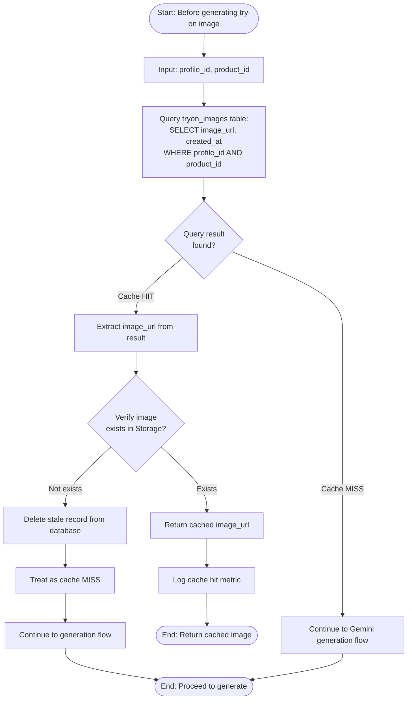
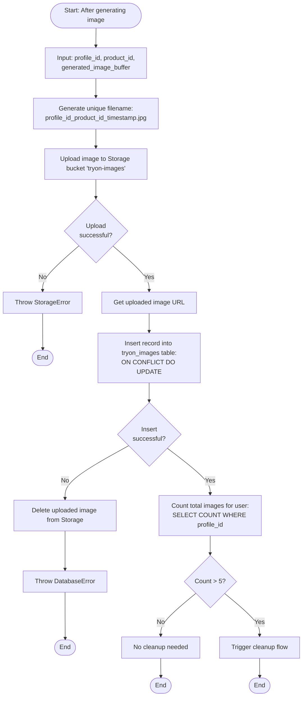
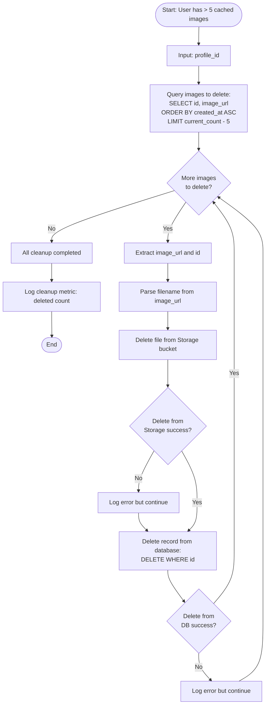
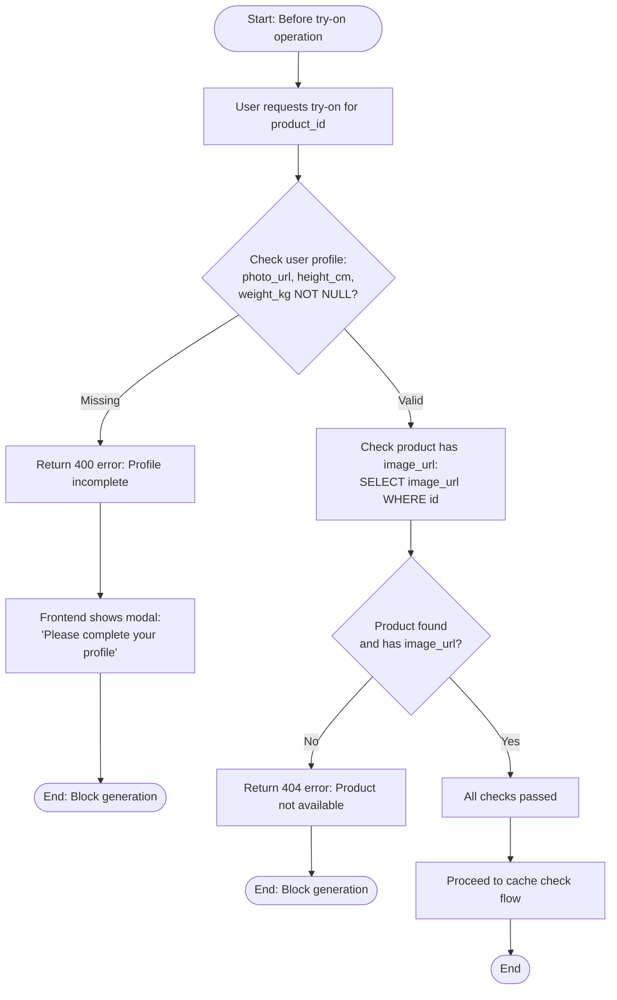

# US-05: Flow Cache Management cho Try-On Images

## Mô tả
Flow quản lý cache ảnh try-on để tối ưu hiệu suất và tiết kiệm chi phí API. Mỗi user chỉ lưu tối đa 5 ảnh try-on, ảnh cũ nhất sẽ bị xóa khi vượt giới hạn (FIFO - First In First Out).

## Actors
- Backend Service (tryon_service.js)
- Database (tryon_images table)
- Supabase Storage (tryon-images bucket)

## Cache Strategy
- **Cache Key:** (profile_id, product_id)
- **Cache Size:** Max 5 images per user
- **Eviction Policy:** FIFO (oldest created_at first)
- **Cache Location:** Database (metadata) + Storage (image files)

## Activity Diagram: Check Cache



## Activity Diagram: Save to Cache



## Activity Diagram: Cleanup Old Images (FIFO)



## Activity Diagram: Pre-check Before Generation



## Database Schema Reference

### tryon_images table
```sql
CREATE TABLE tryon_images (
  id UUID PRIMARY KEY DEFAULT uuid_generate_v4(),
  profile_id UUID NOT NULL REFERENCES profiles(id) ON DELETE CASCADE,
  product_id UUID NOT NULL REFERENCES products(id) ON DELETE CASCADE,
  image_url TEXT NOT NULL,
  created_at TIMESTAMP DEFAULT NOW(),
  UNIQUE(profile_id, product_id)
);

CREATE INDEX idx_tryon_images_profile_created ON tryon_images(profile_id, created_at);
```

### Storage Bucket Configuration
- **Bucket name:** tryon-images
- **Access:** Private (authenticated users only)
- **File pattern:** `{profile_id}_{product_id}_{timestamp}.jpg`
- **Allowed MIME types:** image/jpeg, image/png
- **Max file size:** 5MB

## Cache Performance Metrics

### Key Metrics to Track
- **Cache Hit Rate:** (cache hits / total requests) * 100%
- **Average Generation Time:** Time to generate new image
- **Average Cache Response Time:** Time to return cached image
- **Storage Usage per User:** Average size of 5 images
- **Cleanup Frequency:** How often cleanup runs

### Expected Performance
- **Cache hit:** < 500ms response time
- **Cache miss + generation:** 7-30s (mostly Gemini processing)
- **Target cache hit rate:** > 70% after user has browsed multiple products

## Cache Invalidation Scenarios

### When to Invalidate Cache
1. **User updates avatar:** 
   - Delete all tryon_images for user
   - Force regeneration on next request

2. **User updates body info (height/weight):**
   - Delete all tryon_images for user
   - Force regeneration on next request

3. **Product image changes:**
   - Delete all tryon_images for that product
   - Force regeneration on next request

4. **Manual cleanup (admin action):**
   - Provide admin endpoint to clear cache

### Invalidation Flow
```
START
  |
  v
[Trigger event: avatar/body info update]
  |
  v
[Query all cached images for user:]
  SELECT id, image_url FROM tryon_images WHERE profile_id = {profile_id}
  |
  v
[For each image:]
  |
  v
[Delete file from Storage]
  |
  v
[Delete record from database]
  |
  v
[Log invalidation event]
  |
  v
END
```

## Error Handling in Cache Operations

### Cache Check Errors
- **Database query fails:** Log error, treat as cache miss, proceed to generation
- **Storage verification fails:** Delete stale DB record, treat as cache miss

### Cache Save Errors
- **Storage upload fails:** Return error, don't save to DB
- **DB insert fails:** Delete uploaded file (cleanup), return error
- **Cleanup fails:** Log error but don't block save operation

### Cleanup Errors
- **Storage delete fails:** Log error, continue with DB delete
- **DB delete fails:** Log error, continue with next image
- **Partial cleanup:** Log warning but consider operation successful

## Optimization Strategies

### Read Optimization
- Index on (profile_id, product_id) for fast cache lookup
- Index on (profile_id, created_at) for fast cleanup query
- Use database connection pooling

### Write Optimization
- Async cleanup (don't block response)
- Batch delete operations when possible
- Use ON CONFLICT for upsert (avoid race conditions)

### Storage Optimization
- Compress images before storage (quality: 85%)
- Use appropriate image format (JPEG for photos)
- CDN caching for frequently accessed images

## Testing Recommendations

### Unit Tests
- Test cache hit/miss logic
- Test cleanup when count > 5
- Test cleanup with various counts (6, 10, 20 images)
- Test concurrent save operations
- Test cache invalidation

### Integration Tests
- Test full flow: generate → save → check → cleanup
- Test storage upload/delete operations
- Test with real Supabase instance

### Performance Tests
- Test cache response time (should be < 500ms)
- Test cleanup performance (should not block)
- Test concurrent requests (race conditions)

### Edge Cases
- User deletes all their images
- Product is deleted (cascade delete should work)
- Storage bucket is full
- Database connection lost during cleanup
- Multiple concurrent requests for same product
