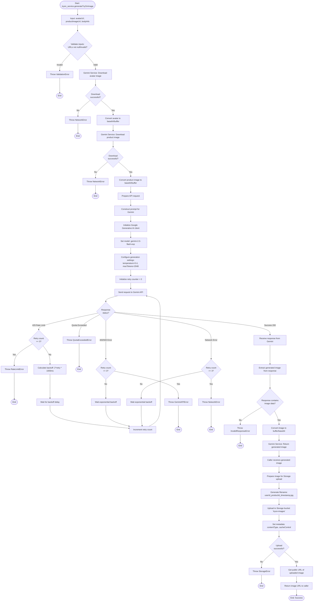

# US-05: Flow sinh ảnh try-on với Google Gemini API

## Mô tả
Flow chi tiết quá trình gọi Google Gemini API để sinh ảnh try-on từ avatar của user và ảnh sản phẩm (flat lay).

## Actors
- Backend Service (tryon_service.js)
- Gemini AI Service (gemini_service.js)
- Google Gemini API
- Supabase Storage

## Preconditions
- User profile có avatar URL (photo_url)
- Product có image URL (image_url)
- User profile có body info (height_cm, weight_kg)
- GEMINI_API_KEY được cấu hình trong .env

## Activity Diagram



## Retry Logic Details

### Exponential Backoff Formula
```
delay = Math.min(2^retry * 1000, 30000)
retry_count = 3
```

### Retry Conditions
- **Rate Limit (429):** Retry với backoff
- **Server Error (500-599):** Retry với backoff
- **Network Error:** Retry với backoff
- **Timeout:** Retry với backoff

### No Retry Conditions
- **Client Error (400, 401, 403, 404):** Không retry
- **Quota Exceeded:** Không retry
- **Invalid API Key:** Không retry

## API Request Example (Pseudocode)

```javascript
const genAI = new GoogleGenerativeAI(process.env.GEMINI_API_KEY);
const model = genAI.getGenerativeModel({ model: "gemini-2.0-flash-exp" });

const prompt = `Generate a realistic image of a person wearing the clothing item...`;

const result = await model.generateContent({
  contents: [
    {
      role: "user",
      parts: [
        { text: prompt },
        { 
          inlineData: {
            mimeType: "image/jpeg",
            data: avatarBase64
          }
        },
        {
          inlineData: {
            mimeType: "image/jpeg",
            data: productBase64
          }
        }
      ]
    }
  ],
  generationConfig: {
    temperature: 0.4,
    maxOutputTokens: 2048,
    topP: 0.8,
    topK: 40
  }
});

const generatedImage = result.response.candidates[0].content.parts[0].inlineData.data;
```

## Error Types & Handling

### GeminiAPIError
- **Cause:** Gemini API trả về lỗi sau khi hết retry
- **HTTP Status:** 500
- **User Message:** "Unable to generate try-on image. Please try again later."
- **Action:** Show retry button

### RateLimitError
- **Cause:** Quá nhiều requests, vượt rate limit
- **HTTP Status:** 429
- **User Message:** "Too many requests. Please wait a moment and try again."
- **Action:** Show retry button, suggest waiting

### QuotaExceededError
- **Cause:** Hết quota API key
- **HTTP Status:** 503
- **User Message:** "Service temporarily unavailable. Please try again later."
- **Action:** Show message, no retry button

### StorageError
- **Cause:** Không upload được ảnh vào Storage
- **HTTP Status:** 500
- **User Message:** "Unable to save image. Please try again."
- **Action:** Show retry button

### NetworkError
- **Cause:** Lỗi mạng khi gọi API hoặc download ảnh
- **HTTP Status:** 500
- **User Message:** "Network error. Please check your connection and try again."
- **Action:** Show retry button

## Performance Considerations

### Expected Response Times
- **Gemini API call:** 5-25 seconds (depends on API load)
- **Image download:** 0.5-2 seconds per image
- **Storage upload:** 1-3 seconds
- **Total:** 7-30 seconds (typical: 10-15s)

### Optimizations
- Cache images aggressively (unique constraint on profile_id + product_id)
- Use appropriate image sizes (max 1920x1080 for avatar/product)
- Compress images before sending to Gemini (quality: 85%)
- Pre-download and cache product images on server

### Monitoring
- Log all Gemini API calls with duration
- Track error rates and types
- Monitor quota usage
- Alert on high error rates (> 10%)

## Security Considerations
- **API Key:** Store in environment variables, never commit to repo
- **Image URLs:** Validate URLs before downloading
- **Rate Limiting:** Implement user-level rate limiting (max 10 requests/minute)
- **Input Validation:** Validate all inputs before calling API
- **Error Messages:** Don't expose internal errors to users

## Cost Considerations
- **Gemini API:** Pay per request, monitor usage
- **Storage:** Pay per GB stored, implement cleanup (max 5 images/user)
- **Bandwidth:** Minimize by caching aggressively
- **Optimization:** Consider batch processing if adding bulk generation features

## Testing Recommendations
- Test with various avatar types (different body types, poses)
- Test with various product types (shirts, pants, dresses)
- Test error scenarios (network failures, API errors, rate limits)
- Test retry logic with mock failures
- Load test to understand capacity limits
- Monitor actual costs in production
