# US-05: Flow chọn danh mục và hiển thị sản phẩm đầu tiên

## Mô tả
Flow này mô tả luồng hoạt động khi user vào phòng thử đồ, chọn một danh mục và xem ảnh try-on của sản phẩm đầu tiên.

## Actors
- User (Người mua đã đăng nhập)
- Frontend (React App)
- Backend API
- Database (Supabase)
- Storage (Supabase Storage)
- Gemini AI Service

## Preconditions
- User đã đăng nhập (có JWT token)
- User đã upload avatar (profiles.photo_url có giá trị)
- User đã nhập thông tin body (profiles.height_cm, weight_kg có giá trị)

## Activity Diagram

```mermaid
flowchart TD
    Start([Start]) --> A[User clicks 'Thử đồ' in navigation]
    A --> B[Frontend: Navigate to /tryon page]
    B --> C{Check user<br/>authenticated?}
    C -->|No| D[Redirect to /login]
    D --> End1([End])
    
    C -->|Yes| E[Frontend: Call GET /api/profile]
    E --> F[Backend: Retrieve profile from database]
    F --> G[Backend: Return profile data]
    G --> H{Validate profile has<br/>photo_url, height_cm,<br/>weight_kg?}
    
    H -->|Missing| I[Show warning modal:<br/>'Please complete your profile']
    I --> J[Provide link to /profile page]
    J --> End2([End])
    
    H -->|Valid| K[Frontend: Show category selector]
    K --> L[Frontend: Call GET /api/categories]
    L --> M[Backend: Retrieve categories from database]
    M --> N[Backend: Return categories list]
    N --> O[Frontend: Display categories in dropdown/tabs]
    O --> P[User selects a category]
    
    P --> Q[Frontend: Call GET /api/tryon/products]
    Q --> R[Backend: Query products where category_id]
    R --> S[Backend: Return products list + count]
    
    S --> T{Products list<br/>empty?}
    T -->|Yes| U[Frontend: Show 'No products' message]
    U --> End3([End])
    
    T -->|No| V[Frontend: Get first product - index 0]
    V --> W[Frontend: Set state currentProductIndex=0]
    W --> X[Frontend: Show loading skeleton]
    X --> Y[Frontend: Call POST /api/tryon/generate]
    
    Y --> Z[Backend: Receive request with product_id]
    Z --> AA{Validate product<br/>exists and has<br/>image_url?}
    AA -->|No| AB[Return 404 error]
    AB --> AC[Frontend: Show error message]
    AC --> End4([End])
    
    AA -->|Yes| AD{Check cache:<br/>tryon_images for<br/>profile + product?}
    AD -->|Cache hit| AE[Backend: Return cached image_url]
    AE --> AF[Frontend: Display cached try-on image]
    AF --> AG[Show product info]
    AG --> End5([End])
    
    AD -->|Cache miss| AH[Backend: Get profile avatar URL]
    AH --> AI[Backend: Get product image URL]
    AI --> AJ[Backend: Call Gemini AI Service]
    
    AJ --> AK{Gemini API<br/>success?}
    AK -->|Error| AL[Backend: Retry with exponential backoff]
    AL --> AM{All retries<br/>exhausted?}
    AM -->|Yes| AN[Return 500 error]
    AN --> AO[Frontend: Show error with retry button]
    AO --> End6([End])
    AM -->|No| AJ
    
    AK -->|Success| AP[Gemini AI: Return generated image]
    AP --> AQ[Backend: Convert image to buffer]
    AQ --> AR[Backend: Upload to Storage 'tryon-images']
    
    AR --> AS{Upload<br/>successful?}
    AS -->|No| AT[Return 500 error]
    AT --> AU[Frontend: Show error message]
    AU --> End7([End])
    
    AS -->|Yes| AV[Storage: Return public URL]
    AV --> AW[Backend: Insert record into tryon_images]
    AW --> AX{Count tryon_images<br/>for user > 5?}
    
    AX -->|Yes| AY[Backend: Delete oldest image]
    AY --> AZ[Backend: Delete file from Storage]
    AZ --> BA[Backend: Return try-on image URL]
    
    AX -->|No| BA
    BA --> BB[Frontend: Display generated try-on image]
    BB --> BC[Frontend: Display product info]
    BC --> BD[Frontend: Display navigation controls]
    BD --> BE[Frontend: Display position indicator]
    BE --> End8([End])
```

## Success Flow Summary
1. User vào trang Try-On và chọn category
2. System check user có đủ profile info
3. Load danh sách products trong category
4. Load sản phẩm đầu tiên (index 0)
5. Check cache, nếu không có thì generate với Gemini AI
6. Upload ảnh vào Storage và lưu vào database
7. Cleanup nếu vượt quá 5 ảnh/user
8. Hiển thị ảnh try-on kèm thông tin sản phẩm

## Alternative Flows
- **No authentication:** Redirect to login
- **Missing profile info:** Show warning modal với link đến profile page
- **Empty category:** Show "No products" message
- **Cache hit:** Return cached image immediately (fast path)
- **Gemini API error:** Retry with backoff, show error if all retries fail
- **Storage upload error:** Show error message

## Postconditions
- User xem được ảnh try-on của sản phẩm đầu tiên trong category
- Ảnh được cache trong database và storage
- UI hiển thị product info và navigation controls
- Ready for user to navigate to next/prev products

## Performance Notes
- Cache hit: < 500ms response time
- Generate new: < 30s (Gemini processing time)
- Show loading skeleton during generation
- Consider showing progress indicator if > 2s

## Error Handling
- All errors return appropriate HTTP status codes
- Frontend shows user-friendly error messages
- Provide retry button for transient errors
- Provide navigation to profile for missing info errors
