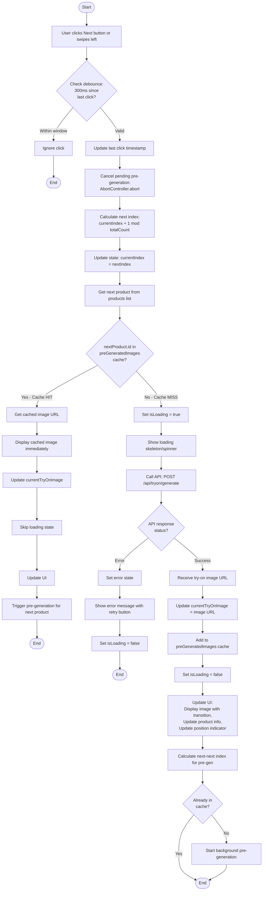
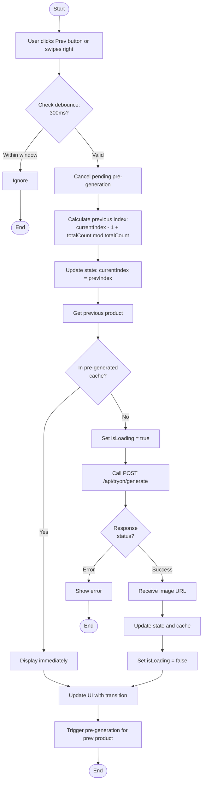
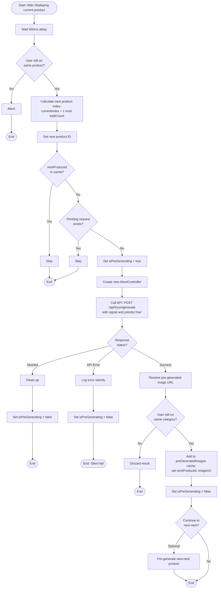
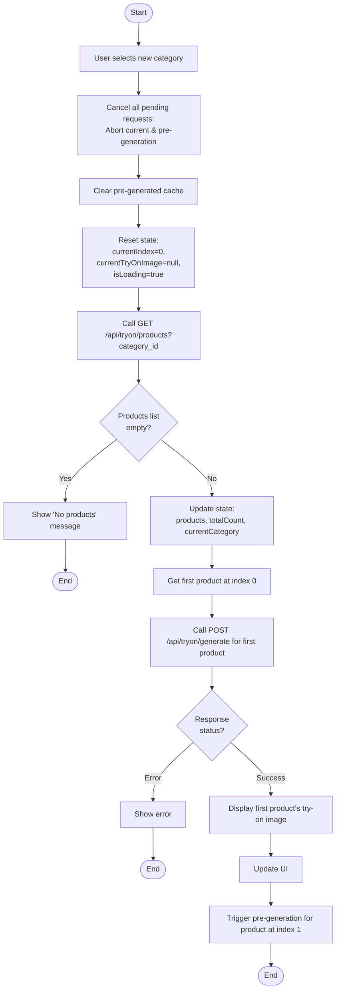

# US-06: Flow điều hướng sản phẩm với Pre-generation

## Mô tả
Flow điều hướng Next/Prev giữa các sản phẩm trong cùng category, với pre-generation ảnh try-on của sản phẩm tiếp theo ở background để tối ưu trải nghiệm user.

## Actors
- User (Người mua)
- Frontend (React App)
- Backend API
- Database
- Gemini AI Service (background)

## Preconditions
- User đã vào phòng thử đồ và đang xem một sản phẩm
- Có ít nhất 2 sản phẩm trong category
- User có avatar và body info

## State Management (Frontend)

### React State Structure
```javascript
{
  currentCategory: UUID,
  products: Array<Product>,  // List of products in category
  currentIndex: number,      // Current product index (0-based)
  totalCount: number,        // Total products in category
  currentTryOnImage: string, // Current displayed try-on image URL
  isLoading: boolean,        // Loading state for current product
  isPreGenerating: boolean,  // Background pre-generation state
  preGeneratedImages: Map<UUID, string>, // Cache of pre-generated images
  error: string | null
}
```

## Activity Diagram: Next Navigation



## Activity Diagram: Previous Navigation



## Activity Diagram: Background Pre-generation



## Activity Diagram: Category Change



## Request Cancellation Strategy

### AbortController Usage
```javascript
let currentGenerationController = null;
let preGenerationController = null;

function navigateToProduct(productId) {
  // Cancel previous generation
  if (currentGenerationController) {
    currentGenerationController.abort();
  }
  
  // Cancel pre-generation
  if (preGenerationController) {
    preGenerationController.abort();
  }
  
  // Start new generation
  currentGenerationController = new AbortController();
  
  fetch('/api/tryon/generate', {
    method: 'POST',
    body: JSON.stringify({ product_id: productId }),
    signal: currentGenerationController.signal
  });
}
```

## UI/UX Considerations

### Loading States
1. **Initial load:** Full-screen skeleton
2. **Navigation with cache hit:** Instant transition (no loading)
3. **Navigation with cache miss:** Small spinner overlay (don't hide current image)
4. **Pre-generation:** Silent background (no UI indication)

### Transitions
- **Fade transition:** 300ms between images
- **Slide transition (optional):** Swipe animation on mobile
- **Position indicator update:** Smooth count animation

### Button States
- **Prev button:** Enabled if > 1 product (wrap around supported)
- **Next button:** Enabled if > 1 product (wrap around supported)
- **Loading button:** Show spinner inside button during generation
- **Error state:** Show retry icon in button

### Keyboard & Touch Support
- **Keyboard:** ← → arrow keys for navigation
- **Touch:** Swipe left/right on mobile (using library like react-swipeable)
- **Accessibility:** Tab navigation, ARIA labels

## Performance Optimizations

### Debouncing
```javascript
const DEBOUNCE_DELAY = 300; // ms
let lastClickTime = 0;

function handleNext() {
  const now = Date.now();
  if (now - lastClickTime < DEBOUNCE_DELAY) {
    return; // Ignore rapid clicks
  }
  lastClickTime = now;
  // Proceed with navigation
}
```

### Cache Management
- **Size limit:** Store max 10 pre-generated images in memory
- **Eviction:** Remove oldest when cache exceeds limit
- **Clear on category change:** Prevent memory bloat

### Network Optimization
- **Request priority:** Mark pre-generation as low priority
- **Parallel limit:** Max 1 pre-generation at a time
- **Retry:** Don't retry pre-generation failures (retry only on user action)

## Error Handling

### Navigation Errors
- **API Error:** Show error message with retry button
- **Network Error:** "Connection error. Please check your network."
- **Rate Limit:** "Too many requests. Please wait a moment."
- **No Image:** Auto-skip to next product or show placeholder

### Pre-generation Errors
- **Silent fail:** Don't show error to user
- **Log error:** Log to console/monitoring for debugging
- **Retry on demand:** Will regenerate when user navigates

### Edge Cases
- **Single product in category:** Disable navigation buttons
- **Last product:** Wrap to first on Next
- **First product:** Wrap to last on Prev
- **Empty category:** Show message, disable navigation

## API Endpoints Used

### GET /api/tryon/products
```
Query params: category_id
Response: {
  products: [
    { id, name, image_url, price, category_id }
  ],
  total: number
}
```

### POST /api/tryon/generate
```
Body: { product_id }
Response: {
  image_url: string,
  cached: boolean,
  product: { id, name, price, category_id }
}
```

### GET /api/tryon/products/:id/context (Optional optimization)
```
Response: {
  current: Product,
  prev_id: UUID | null,
  next_id: UUID | null,
  position: number,
  total: number
}
```

## Testing Recommendations

### Functional Tests
- Test Next navigation with cache hit/miss
- Test Prev navigation with wrap around
- Test rapid clicking (debounce)
- Test keyboard navigation
- Test touch swipe on mobile
- Test category change (cache clearing)

### Performance Tests
- Test pre-generation timing (should be background)
- Test transition smoothness (60fps)
- Test memory usage with large cache
- Test request cancellation

### Edge Case Tests
- Category with 1 product
- Category with 100+ products
- Network interruption during navigation
- API error during pre-generation
- User rapidly switching categories

### Integration Tests
- Full flow: select category → view first → navigate 5 products
- Pre-generation working correctly
- Cache being used on second pass through products
- Cleanup when switching categories
